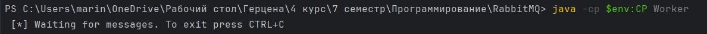

# Практическая работа - RabbitMQ

## Для начала работы

1. Установим Erlang/OTP
2. Установим RabbitMQ
3. Далее включим UI:
```cd C:\Program Files\RabbitMQ Server\rabbitmq_server-4.0.5\sbin```
```./rabbitmq-plugins.bat enable rabbitmq_management```
По адресу localhost:15672 и с данными для входа guest:guest мы можем попасть в Web UI.
4. В рабочую папку загрузим клиентскую библиотеку и ее зависимости ( SLF4J API и SLF4J Simple ). Скачать можно [тут](https://www.rabbitmq.com/tutorials/tutorial-one-java)

## Задание 1: реализация очереди задач (Task Queue)

Создадим два файла: 

* ```NewTast.java``` - Производитель (Producer): отправляет задачи в очередь RabbitMQ

```java
import com.rabbitmq.client.Channel;
import com.rabbitmq.client.Connection;
import com.rabbitmq.client.ConnectionFactory;
import com.rabbitmq.client.MessageProperties;

public class NewTask {

    private static final String TASK_QUEUE_NAME = "task_queue";

    public static void main(String[] argv) throws Exception {
        ConnectionFactory factory = new ConnectionFactory();
        factory.setHost("localhost");
        try (Connection connection = factory.newConnection();
             Channel channel = connection.createChannel()) {
            channel.queueDeclare(TASK_QUEUE_NAME, true, false, false, null);

            String message = String.join(" ", argv);

            channel.basicPublish("", TASK_QUEUE_NAME,
                    MessageProperties.PERSISTENT_TEXT_PLAIN,
                    message.getBytes("UTF-8"));
            System.out.println(" [x] Sent '" + message + "'");
        }
    }

}
```

* ```Worker.java``` - Потребитель (Consumer): получает задачи из очереди и обрабатывает их.

```java
import com.rabbitmq.client.Channel;
import com.rabbitmq.client.Connection;
import com.rabbitmq.client.ConnectionFactory;
import com.rabbitmq.client.DeliverCallback;

public class Worker {

    private static final String TASK_QUEUE_NAME = "task_queue";

    public static void main(String[] argv) throws Exception {
        ConnectionFactory factory = new ConnectionFactory();
        factory.setHost("localhost");
        final Connection connection = factory.newConnection();
        final Channel channel = connection.createChannel();

        channel.queueDeclare(TASK_QUEUE_NAME, true, false, false, null);
        System.out.println(" [*] Waiting for messages. To exit press CTRL+C");

        channel.basicQos(1);

        DeliverCallback deliverCallback = (consumerTag, delivery) -> {
            String message = new String(delivery.getBody(), "UTF-8");

            System.out.println(" [x] Received '" + message + "'");
            try {
                doWork(message);
            } finally {
                System.out.println(" [x] Done");
                channel.basicAck(delivery.getEnvelope().getDeliveryTag(), false);
            }
        };
        channel.basicConsume(TASK_QUEUE_NAME, false, deliverCallback, consumerTag -> { });
    }

    private static void doWork(String task) {
        for (char ch : task.toCharArray()) {
            if (ch == '.') {
                try {
                    Thread.sleep(1000);
                } catch (InterruptedException _ignored) {
                    Thread.currentThread().interrupt();
                }
            }
        }
    }
}
```
Скомпилируем их:

``` javac -cp amqp-client-5.16.0.jar Worker.java NewTask.java ```

Далее перейдем к тестированию. Для этого нам понадобиться три консоли: две будут потребителями, а в третьей мы будем отправлять задачи. 

Для удобства сделаем переменную окружения для classpath:
```$env:CP = ".;amqp-client-5.16.0.jar;slf4j-api-1.7.36.jar;slf4j-simple-1.7.36.jar"```

Консоль 1:


Консоль 2:


Консоль 3:


Теперь посмотрим, что доставилось нашим потребителям:
Консоль 1:


Консоль 2:


По умолчанию RabbitMQ будет отправлять каждое сообщение следующему потребителю в последовательности. В среднем каждый потребитель получит одинаковое количество сообщений. Такой способ распределения сообщений называется циклическим. 

## Задача 2: реализация системы публикации/подписки (Publish/Subscribe)


